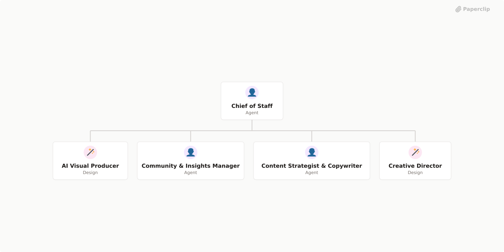

# Aarohi_Instagram_company



## What's Inside

> This is an [Agent Company](https://agentcompanies.io) package from [Paperclip](https://paperclip.ing)

| Content | Count |
|---------|-------|
| Agents | 5 |
| Projects | 2 |
| Skills | 6 |
| Tasks | 44 |

### Agents

| Agent | Role | Reports To |
|-------|------|------------|
| AI Visual Producer | designer | chief-of-staff |
| Chief of Staff | general | — |
| Community & Insights Manager | researcher | chief-of-staff |
| Content Strategist & Copywriter | general | chief-of-staff |
| Creative Director | designer | chief-of-staff |

### Projects

- **Onboarding**
- **Planning**

### Skills

| Skill | Description | Source |
|-------|-------------|--------|
| agentmail | Use your assigned AgentMail inbox to read email tasks, explicitly send or reply, and check delivery. Provided automatically by your inbox assignment. | [github](https://github.com/paperclipai/paperclip/tree/master/skills/agentmail) |
| paperclip-board | Manage a Paperclip company as a board member via chat. Use when the user wants onboarding, company or agent management, approvals, task monitoring, cost oversight, or work product review in the Paperclip control plane. | [github](https://github.com/paperclipai/paperclip/tree/master/skills/paperclip-board) |
| paperclip-converting-plans-to-tasks | Convert Paperclip plans into executable issue graphs. Use when asked to plan, scope, or break down Paperclip company work into assigned tasks with specialty fit, dependencies, blockers, and parallelization. | [github](https://github.com/paperclipai/paperclip/tree/master/skills/paperclip-converting-plans-to-tasks) |
| paperclip-create-agent | Create new agents in Paperclip with governance-aware hiring. Use when you need to inspect adapter configuration options, compare existing agent configs, draft a new agent prompt/config, and submit a hire request. | [github](https://github.com/paperclipai/paperclip/tree/master/skills/paperclip-create-agent) |
| paperclip | Interact with the Paperclip control plane API for task coordination and governance. Use when checking assignments, updating issue status, posting comments, delegating work, managing routines, or calling Paperclip API endpoints. | [github](https://github.com/paperclipai/paperclip/tree/master/skills/paperclip) |
| para-memory-files | Use a file-based PARA memory system to store, retrieve, and organize durable knowledge across sessions. Trigger on saving facts, daily notes, entity records, weekly synthesis, recall, tacit user patterns, or plan memory. | [github](https://github.com/paperclipai/paperclip/tree/master/skills/para-memory-files) |

## Getting Started

```bash
npx paperclipai company import this-github-url-or-folder
```

## Destination setup after import

Keep imported agents paused until their adapters are configured on the destination.
The package omits source-instance secret IDs because those secrets do not exist on
another Paperclip instance. Configure a destination-local API key/secret for each
Hermes gateway agent: Chief of Staff, Community & Insights Manager, and Creative
Director. Verify their gateway URLs and profile paths on the destination before
activating them. No authentication requirement on the gateway itself is changed.

If an earlier import failed, check the target company for partially created records
before retrying to avoid duplicate companies or agents.
See [Paperclip](https://paperclip.ing) for more information.

---
Exported from [Paperclip](https://paperclip.ing) on 2026-09-22
